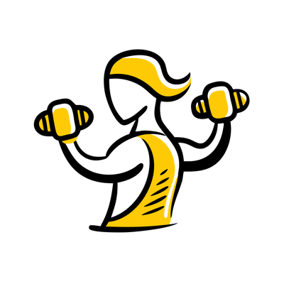

# Tuffgal

[](LICENSE)

JSON-driven visual regression testing for web apps.



**Status:** Pre-1.0. Published on npm as `tuffgal@0.1.0-alpha.2` with
provenance. [Linklater](https://github.com/nschneble/linklater) is the
pilot consumer.

Public API is unstable until `v1.0.0`.

## The idea

Tuffgal sits between component tests (which are fast but mocked) and
end-to-end tests (which are real but verbose). You write **actions**
(atomic user steps) and **stories** (chains of actions) as pure JSON. The
harness runs them in a real browser, captures a screenshot after each
story, and pixel-diffs against a baseline you commit alongside your code.

When a screenshot changes, a human reviews the diff and decides what to do.

## What ships in v1

- 10 step primitives as action verbs: `click`, `input`, `intercept`,
  `navigate`, `read`, `scroll`, `type`, `wait`, `waitFor`, and `screenshot`
  as the implicit capture point
- DAG scheduler with `needs`/`produces` labels and parallel workers
- SSIM-gated visual diff + pixelmatch overlay + a11y-tree snapshots
- Trace zip on failure (Playwright trace viewer)
- Clock freeze (`page.clock.install`)
- Storage-state persistence across stories
- Static HTML reporter + optional SARIF for GitHub code scanning
- V8 coverage (optional via `monocart-coverage-reports`)
- Per-story DB reset + fixture hooks (consumer-supplied via config)
- Process supervisor for dev-server hot-reload rot (it happens)

## What's explicitly out of scope (v1)

- AI fuzzy locator matching (deferred to v1.1, BYOLLM)
- Hosted SaaS / cloud runs
- Native mobile (Playwright cannot drive it)
- WebDriver / Puppeteer substrate
- Supporting browsers other than Chromium

## Quick start

```bash
npm install -D tuffgal@alpha
npx tuffgal init  # scaffolds tuffgal.config.ts
npx tuffgal run   # runs all stories
```

For CI on GitHub Actions, use the companion
[`nschneble/tuffgal-action`](https://github.com/nschneble/tuffgal-action)
composite action.

## Documentation

- [App contract](docs/app-contract.md)
- [Authoring guide](docs/authoring.md)
- [CI integration](docs/ci.md)
- [Config reference](docs/config.md)
- [Migrating from Cypress](docs/migration-cypress.md)
- [Migrating from Playwright](docs/migration-playwright.md)
- [Product requirements](docs/prd-v1.md)
- [Supervisor](docs/supervisor.md)

## License

MIT. See [LICENSE](LICENSE).

## Roadmap

| Milestone                  | Status   |
| -------------------------- | -------- |
| Repo bootstrap             | ✅       |
| Core extraction            | ✅       |
| Bridges                    | ✅       |
| Linklater migration        | ✅       |
| GitHub Action              | ✅       |
| `v0.1.0-alpha` npm publish | ✅       |
| `v1.0.0` public launch     | ⏳       |
| `v1.1.0` AI fuzzy matching | Deferred |

## Acknowledgements

The Tuffgal logo is an illustration by [Art Attack](https://unsplash.com/@artattackzone) on [Unsplash](https://unsplash.com/illustrations/a-woman-with-two-dumbs-in-her-hands-0GxJHpQzVvs).
