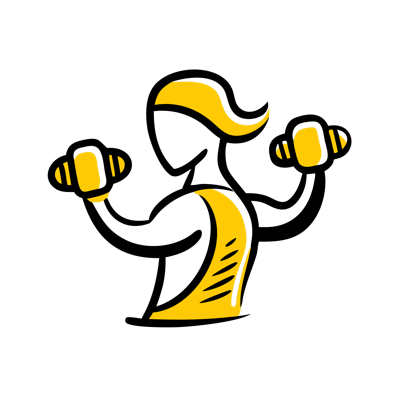

# Tuffgal

[](LICENSE)

JSON-driven visual regression testing for web apps.



**Status:** Pre-1.0. Published on npm as `tuffgal@0.2.0-alpha.{n}` with
provenance. [Linklater](https://github.com/nschneble/linklater) is the
pilot consumer.

Public API is unstable until `v1.0.0`.

## The idea

Tuffgal sits between component tests (which are fast but mocked) and
end-to-end tests (which are real but verbose). You write **actions**
(atomic user steps) and **stories** (chains of actions) as pure JSON. The
harness runs them in a real browser, captures a screenshot after each
action, and pixel-diffs against a committed baseline.

When a screenshot changes, a human reviews the diff and decides what to do.

## CI owns the baselines

Committed baselines are the source of truth for what your UI is supposed to look
like, and **CI is their only writer**. That makes a visual change a pull-request
review gate, exactly like a code change: CI renders the current UI, diffs it
against the committed baselines, and if anything drifted it fails the check and
publishes the new screenshots as an artifact. A human looks at the diff and,
if the change is intended, promotes those screenshots into the committed set. No
local run can overwrite the baselines your reviewers rely on.

A `tuffgal run` executes under one of two modes:

- **CI mode** compares against the committed baselines (`paths.baselines`) and
  never writes them. A missing baseline is `new`, an orphaned one is `deleted`,
  and drift is `changed`, all of which are written into a self-contained
  **candidate tree** under `<report>/candidates/` for approval, not committed in
  place. CI mode gates: pending changes exit `2`.
- **Local mode** is advisory. It compares against a gitignored, per-machine
  cache (`paths.localCache`) so you can self-diff while you iterate, seeding a
  missing entry on first sight. A local run **never reads or writes the
  committed baselines**, and never fails your build on visual drift. It surfaces
  the signal in the report and on stdout and **exits `0`**. Only a failed story
  (a step that threw) exits `1`; the CI-gating codes `2` and `3` never fire
  locally.

Mode resolves from `--ci` / `--local` (an explicit flag always wins). With
neither, Tuffgal picks CI when `$CI` is truthy and local otherwise, so the same
`tuffgal run` does the right thing on a laptop and in a workflow.

### Approving a visual change

Two ways to accept a `changed`/`new` candidate into the committed baselines,
both writing through the single `approve --from` promotion path:

- **Download and commit.** Grab the `candidates` artifact CI uploaded, run
  `tuffgal approve --from <dir>` against it, and commit the resulting baselines.
  `--from` refuses any candidate that is not a clean CI run (`mode !== 'ci'` or a
  failed story), so a local or broken run can never be promoted. Add `--prune`
  to also retire baselines the run flagged as `deleted`.
- **Comment on the PR.** The intended flow is a `@tuffgal approve` PR comment
  that runs the same promotion on the CI side. The Action that handles this is a
  downstream, not-yet-shipped repo, so treat this as the direction of travel
  rather than a shipped button today.

Plain `tuffgal approve` (no `--from`) targets your **local cache** only. It
accepts your own self-diff so your next local run is clean. It does not touch the
committed set.

### The environment manifest

`approve --from` also writes `baselines/manifest.json` recording the environment
the promoted baselines were captured under. The keys compared for drift are
capture schema, browser version, platform, capture mode, color scheme,
breakpoints, device scale factor, and frozen time. On the next `run --ci`
Tuffgal checks the live capture environment against it. A pixel-affecting
mismatch still runs the comparison, but banners the report and exits `3`: the
signal is "expect a full re-approve", distinct from ordinary pending changes.

### Exit codes

| Code | Mode | Meaning                                                                   |
| ---- | ---- | ------------------------------------------------------------------------- |
| `0`  | both | Clean: no failures; in CI, no pending changes and the environment matched |
| `1`  | both | One or more stories failed (a step threw). Highest precedence             |
| `3`  | CI   | Committed environment manifest diverged from this run's environment       |
| `2`  | CI   | Pending baseline changes to approve (`new`, `changed`, or `deleted`)      |

Precedence is `1` > `3` > `2` > `0`. Local mode only ever exits `1` or `0`.

## What ships in v1

- 9 step primitives composed into actions: `click`, `input`, `intercept`,
  `navigate`, `read`, `scroll`, `type`, `wait`, `waitFor`
- An implicit screenshot at the end of every action
- Named breakpoint modes (`mobile`, `tablet`, `laptop`, `desktop`) keyed to
  Tailwind widths. Pick which to run per project or per story. Each mode
  gets its own baseline and a per-mode group in the HTML report
- DAG scheduler with `needs`/`produces` labels and parallel workers
- CI-owned baselines: CI is the sole writer, local runs are advisory self-diff,
  approval flows through a CI candidate tree + environment manifest
- SSIM-gated visual diff + pixelmatch overlay + a11y-tree snapshots (in CI an
  a11y-tree drift also flips a pixel-passing action to `changed`)
- Trace zip on failure (Playwright trace viewer)
- Clock freeze (`page.clock.install`)
- Storage-state persistence across stories
- Static HTML reporter
- V8 coverage (optional via `monocart-coverage-reports`)
- Per-breakpoint-pass DB reset + per-story fixture hooks (consumer-supplied via config),
  plus a `${breakpoint}` interpolation token for per-mode test data
- Process supervisor for dev-server hot-reload rot (it happens)

## What's explicitly out of scope (v1)

- AI fuzzy locator matching
- Hosted SaaS / cloud runs
- Native mobile (Playwright cannot drive it)
- WebDriver / Puppeteer substrate
- Supporting browsers other than Chromium

## Quick start

```bash
npm install -D tuffgal@alpha
npx tuffgal init  # scaffolds tuffgal.config.ts
npx tuffgal run   # runs all stories
```

For CI on GitHub Actions, use the companion
[`nschneble/tuffgal-action`](https://github.com/nschneble/tuffgal-action)
composite action.

## Documentation

- [App contract](docs/app-contract.md)
- [Authoring guide](docs/authoring.md)
- [Changelog](CHANGELOG.md)
- [CI integration](docs/ci.md)
- [CLI reference](docs/cli.md)
- [Config reference](docs/config.md)
- [Migrating from Cypress](docs/migration-cypress.md)
- [Migrating from Playwright](docs/migration-playwright.md)
- [Product requirements](docs/prd-v1.md)
- [Reporting data (results.json)](docs/reporting.md)
- [Supervisor](docs/supervisor.md)

## License

MIT. See [LICENSE](LICENSE).

## Roadmap

| Milestone                  | Status |
| -------------------------- | ------ |
| Repo bootstrap             | ✅     |
| Core extraction            | ✅     |
| Bridges                    | ✅     |
| Linklater migration        | ✅     |
| GitHub Action              | ✅     |
| `v0.1.0-alpha` npm publish | ✅     |
| `v1.0.0` public launch     | ⏳     |

## Acknowledgements

The Tuffgal logo is an illustration by [Art Attack](https://unsplash.com/@artattackzone) on [Unsplash](https://unsplash.com/illustrations/a-woman-with-two-dumbs-in-her-hands-0GxJHpQzVvs).
